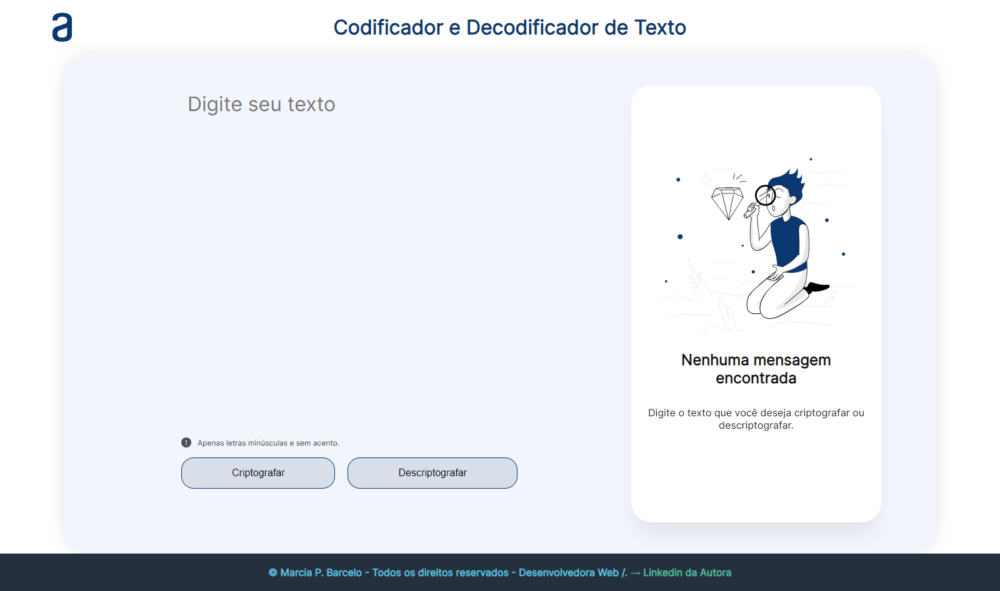

# Challenge ONE - Iniciante em Programação

Bem-vindo ao Challenge ONE para iniciantes em programação! Este desafio foi desenvolvido para de cumprir o desafio do curso Front-end Alura em parceira com a Oracle!! construindo um simples decodificador de texto utilizando JavaScript.

## Descrição do Desafio

O objetivo deste desafio é criar uma aplicação web que permita aos usuários codificar e decodificar textos. O desenvolvimento da aplicação foi realizado usando HTML, CSS e JavaScript.

## Funcionalidades

- **Entrada de Texto:** Os usuários podem inserir ou colar o texto desejado em uma área específica.
  
- **Botões de Operação:** Botões dedicados para realizar as operações de codificação e decodificação.

- **Exibição do Resultado:** Uma área onde o resultado da operação é mostrado, seja o texto codificado ou decodificado permitindo ao usuário copiar o resultado.

## Autor

Este desafio foi realizado por Marcia Barcelo. Para mais informações, acesse a [Página publicada](https://mpbarcelo.github.io/codificador-descodificador-alura-challengue/).

**Realize sua descodificação!** 🚀
